<div align="center">

# Polymarket-quant

### Agentic Alpha Research with Deterministic Execution Governance

**让 AI 负责发现 Alpha，让确定性系统负责保护资金。**


</div>

---

`std0-quant` is an auditable quantitative research system for **Polymarket market microstructure research**.

It separates two responsibilities:

- **AI / Agent:** discover factors, validate hypotheses, generate strategy candidates.
- **Deterministic System:** control risk, execution evidence, governance, and production eligibility.

> **Research Brain THINK → Deterministic System ACT**

AI can research and propose.  
AI cannot hold LIVE credentials, bypass the Risk Gate, promote itself to production, or submit real orders.

## Architecture

```mermaid
flowchart LR
    A[Research Agent] --> B[Factor Factory]
    B --> C[Factor Registry]
    C --> D[Alpha Factory]
    D --> E[Strategy Candidate]
    E --> F[Risk Gate]
    F --> G[OrderIntent]
    G --> H[SHADOW]
    H --> I[Execution Evidence]
    I --> J[Production Governance]
    J --> K[LIVE]

    K:::blocked
    classDef blocked fill:#fdd,stroke:#d33,stroke-width:2px;
```



The system deliberately separates:

```text
SHADOW PASS
    ≠
EXECUTION PASS
    ≠
PRODUCTION_ELIGIBLE
```

## Core Capabilities

- Agentic factor discovery
- Out-of-sample / null / baseline validation
- Temporal stability testing
- Versioned Factor Registry
- Alpha → Strategy Candidate composition
- Deterministic Risk Gate
- SHADOW execution
- Execution provenance
- Measured venue telemetry validation
- Production eligibility governance
- Hash-bound, auditable artifacts

## Safety Boundary

The LLM is not part of the millisecond execution path.

The Agent cannot:

- load private keys or LIVE credentials;
- submit real venue orders;
- bypass deterministic risk controls;
- modify frozen research semantics;
- directly promote Factors;
- authorize Production Eligibility.

The system is designed to **fail closed** when evidence, identity, provenance, or accounting is inconsistent.

## Current Status

| Layer | Status |
| --- | :---: |
| Research / Validation | CLOSED |
| Factor Factory | CLOSED |
| Alpha Factory | CLOSED |
| Risk Gate | CLOSED |
| SHADOW Execution | CLOSED |
| Execution Evidence | CLOSED |
| Production Governance | CLOSED |
| **LIVE Execution** | **STOP** |

> **LIVE Execution is not authorized.**

## Repository Layout

```text
src/std0_quant/
├── alpha/
├── execution/
├── factors/
├── registry/
├── research/
└── risk/

tests/
release/
manifest/
bootstrap/
```

## Quick Start

```bash
git clone https://github.com/howei-ai/Polymarket-quant.git
cd Polymarket-quant
```

This repository is intended for **quantitative research, execution validation, and production governance**.

It should not be interpreted as:

- an AI auto-profit bot;
- proof of long-term profitability;
- deployed LIVE trading;
- completed production trading authorization.

## Design Principle

```text
Learn
  ↓
Candidate
  ↓
Validate
  ↓
Version
  ↓
Deploy
```

Never:

```text
Learn → Production
```

---

<div align="center">

**Research Brain THINK · Deterministic System ACT**

</div>
